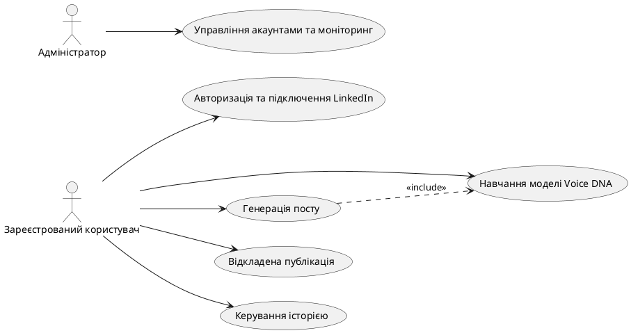
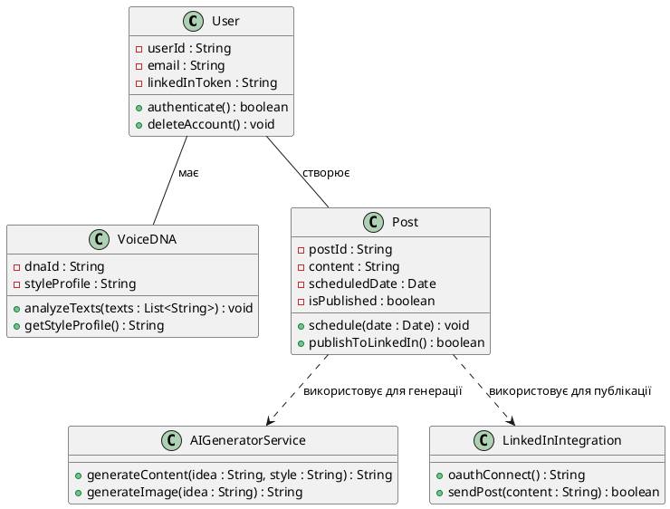
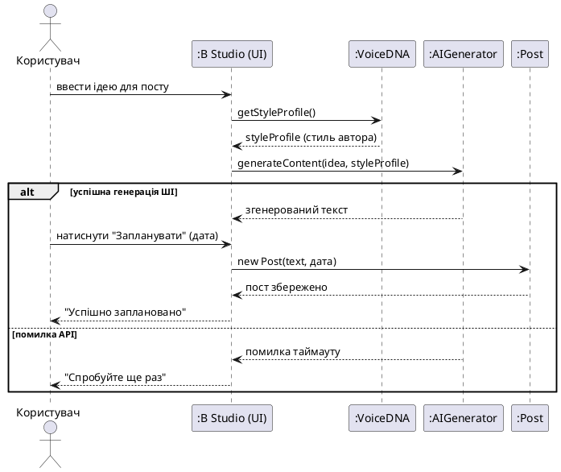

Aaptics — це SaaS-платформа на базі штучного інтелекту для активних авторів LinkedIn, яка вирішує проблему шаблонного тексту завдяки технології "Voice DNA", що аналізує та вивчає індивідуальний стиль користувача.

- FR-01: Система повинна дозволяти реєстрацію та авторизацію через email або Google.
- FR-02: Система повинна інтегруватися з API LinkedIn за протоколом OAuth 2.0.  
- FR-03: Система повинна дозволяти завантаження 3-4 старих текстів користувача для формування профілю "Voice DNA". 
- FR-04: Система повинна генерувати текст посту на основі короткої ідеї та збереженого стилю.
- FR-06: Користувач повинен мати можливість запланувати відкладену публікацію.

### Матриця трасовності

| Вимога | Use Case | Класи | Sequence Diagram |
| --- | --- | --- | --- |
| **FR-01** (Реєстрація)
| UC-01 | User | — |
| **FR-02** (Інтеграція LinkedIn)
| UC-01 | User, LinkedInIntegration | — |
| **FR-03** (Створення Voice DNA)
| UC-02 | User, VoiceDNA | — |
| **FR-04** (Генерація посту)
| UC-03 | VoiceDNA, Post, AIGeneratorService | SD-01 (Генерація посту) |
| **FR-06** (Планування)
| UC-04 | Post | SD-01 (фрагмент) |
